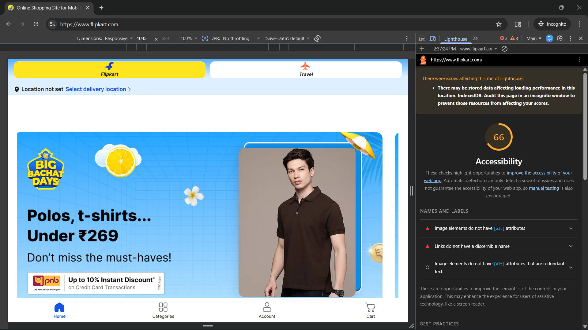
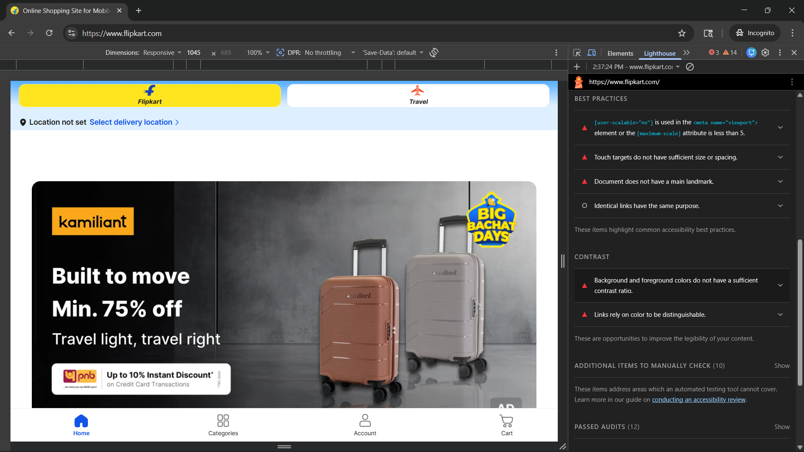

# Accessibility-Evaluation-of-Flipkart

## 📌 Overview
This project focuses on evaluating accessibility issues on a live e-commerce website using both automated and manual testing techniques.

## 🎯 Objective
To identify accessibility issues affecting users with disabilities and suggest improvements based on accessibility best practices.

## 🛠 Tools Used
- Google Lighthouse (Automated Testing)
- NVDA Screen Reader (Manual Testing)
- Keyboard Navigation Testing

## 🧪 Testing Strategy
- Combined automated and manual testing approach
- Focus on real user experience for visually impaired users
- Validation using screen reader + keyboard navigation

## ✅ Test Scenarios Covered
- Image alt text validation
- Link accessibility
- Keyboard navigation (Tab key)
- Screen reader behavior (NVDA)

## 🚨 Key Issues Found
- Missing alt text in images
- Buttons and icons not accessible via screen reader
- Search bar not properly detected by NVDA
- Poor keyboard navigation

## 📊 Accessibility Score
- Lighthouse Score: 66/100

## 📷 Screenshots
### Img. 1.0 Missing alt text for images_ unclear labels

### Img. 1.1 Zoom disabled

### Img. 1.2 Low color contrast

### Img. 1.3 Search bar not properly detected by screen reader

### Img. 1.4 Interactive icons not accessible by screen reader

## 📄 Reports
- Detailed report available in `/reports`

## 💡 Conclusion
This project demonstrates the importance of accessibility testing using both automated tools and assistive technologies to ensure inclusive user experience.
